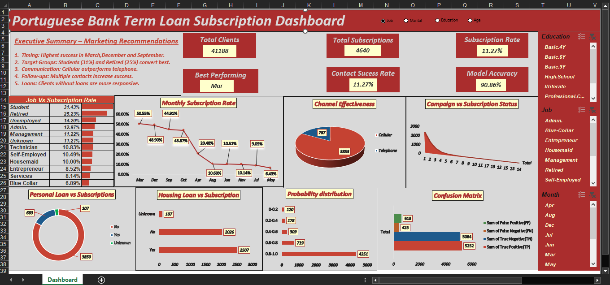

# 📊 Portuguese Bank Term Loan Subscription Dashboard (Excel)

This interactive Excel dashboard provides deep insights into the **marketing performance** and **subscription patterns** of a Portuguese bank term deposit campaign. Built entirely using **Excel data visualization techniques**, the dashboard combines executive summary, KPIs, and advanced visuals to aid strategic decisions.

---

## 📌 Project Objective

To analyze term deposit subscription data and:
- Identify customer segments with high conversion rates.
- Evaluate channel performance (Cellular vs Telephone).
- Discover optimal campaign periods and contact success patterns.
- Visualize the model accuracy and confusion matrix from predictive modeling.

---

## 📈 Key Features

- 🔴 **Interactive Dashboard Layout** with slicers for job, education, marital status, and month.
- 📌 **Executive Summary Box** with marketing recommendations based on findings.
- 📊 Charts used:
  - Subscription rate by job role
  - Monthly trendline of subscriptions
  - Channel effectiveness pie chart
  - Campaign vs Subscription analysis
  - Donut chart: Personal loan vs Subscriptions
  - Housing loan and probability distribution
  - Confusion Matrix for classification model evaluation
- ✅ **KPI Cards**: Total Clients, Subscriptions, Model Accuracy, Best Month, and Contact Rate.

---

## 📂 Files Included

| File Name                                      | Description                              |
|-----------------------------------------------|------------------------------------------|
| `Portuguese_Bank_Subscription_Dashboard.xlsx` | Final Excel dashboard with slicers, KPIs |
| `Raw_Data.csv` *(optional)*                   | Source data used to create dashboard     |
| `README.md`                                   | Project documentation                    |

---

## 📊 Sample Dashboard Preview

---

## 💡 Insights from the Dashboard

- **March, December, and September** were the best performing months.
- **Students (31%) and Retired individuals (25%)** showed the highest subscription rates.
- **Cellular outreach** proved far more effective than telephone.
- Multiple contacts increased conversion likelihood.
- Clients **without loans** were more responsive to subscriptions.

---

## 🛠️ Tools Used

- Microsoft Excel (Dashboarding)
- Excel Slicers & Pivot Charts
- Conditional Formatting
- Confusion Matrix from classification model (optional Python output incorporated)

---

## 📁 Folder Structure Suggestion

